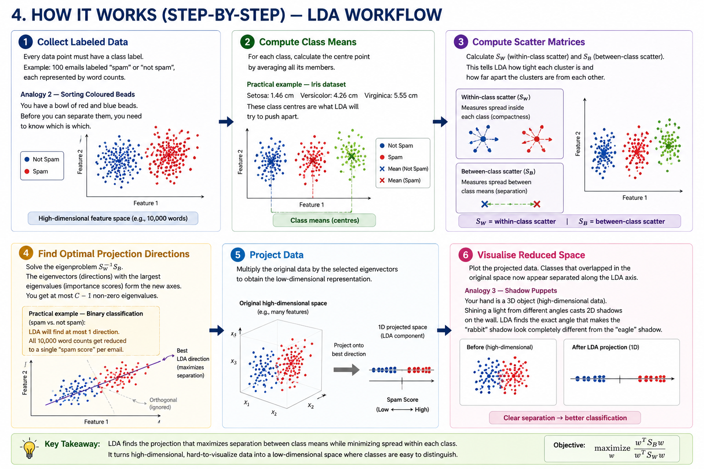

## 1. HEADER

# Linear Discriminant Analysis (LDA) for Dimensionality Reduction

**Tagline:** Separate classes, reduce dimensions — LDA finds the axes that best tell categories apart.

**Learning Summary:** What LDA is, how it differs from PCA, when to use it and when to avoid it, its step-by-step logic, the meaning behind its equations, and how to apply it in Python — all without any prior ML knowledge.

---

## 2. WHAT IS LDA?

### What LDA Is

Linear Discriminant Analysis (LDA) is a supervised dimensionality-reduction algorithm. It takes data where each point already has a category label (e.g., "spam" or "not spam") and finds new axes that satisfy two competing goals: push different categories as far apart as possible, while keeping points from the same category as close together as possible.

### Why It Was Invented

Ronald Fisher introduced LDA in 1936 to solve a classification problem: given measurements of iris flowers (petal length, sepal width, etc.), find a linear combination of those measurements that best separates the three species. His key observation was that not all variation in data is useful. The differences *between* species help you classify; the variation *within* a species (e.g., some irises are just bigger than others) is irrelevant clutter. LDA was designed to keep the first and discard the second.

### Difference Between PCA and LDA

| Concept | PCA | LDA |
|---|---|---|
| Uses labels? | No (unsupervised) | Yes (supervised) |
| Goal | Preserve total variance | Maximise class separation |
| What it sees | All points, ignoring groups | Points + their group labels |
| Best for | Compression, noise removal | Classification preprocessing |

Think of PCA as a photographer taking a wide-angle shot of a crowd — it captures everyone. LDA is a director who first asks "who's in which team?" and then positions the camera to make the teams look as far apart as possible.

### Why Labels Matter

Without labels, PCA treats every data point equally.

**Practical example — Cancer screening:** You have 1000 blood test results (each with 50 biomarkers) from healthy patients and cancer patients. Without labels, PCA would find the biomarkers that vary the most across all 1000 samples — which could be harmless things like cholesterol levels. With labels, LDA finds the biomarkers that *differ between* healthy and cancer patients — exactly what a doctor needs. LDA uses the labels to figure out which directions help distinguish one group from another. This is the fundamental difference: **PCA cares about variance; LDA cares about separability**.

### Real-World Analogy

**Analogy 1 — Spot the Difference Game.** Imagine two nearly identical pictures side by side. A beginner (PCA) looks at the whole picture and notices the bright colours everywhere. An expert (LDA) knows there are differences in five specific spots and ignores everything else. LDA is the expert: it focuses only on what changes between the two pictures.

---

## 3. MATHEMATICAL FORMULATION

We need four quantities before we can write the LDA objective. Let's define them.

### Notation

| Symbol | Meaning | Example |
|---|---|---|
| \( C \) | Number of classes (categories) | 3 (dog, cat, bird) |
| \( N \) | Total number of samples | 1000 images |
| \( N_i \) | Number of samples in class \( i \) | 300 dogs |
| \( x_j^{(i)} \) | The \( j \)-th sample belonging to class \( i \) | A feature vector for one dog image |
| \( \mu_i \) | **Class mean** — average of all samples in class \( i \) | The "average dog" |
| \( \mu \) | **Global mean** — average of all \( N \) samples | The "average of everything" |
| \( d \) | Original number of features (dimensions) | 256 pixels |
| \( k \) | Target number of dimensions after reduction | 2 (for plotting) |

### Class Mean \( \mu_i \)

\[
\mu_i = \frac{1}{N_i} \sum_{j=1}^{N_i} x_j^{(i)}
\]

Take all the dogs, add their pixel values together, divide by the number of dogs. The result is a single "average dog" vector. That is the class mean for the dog class.

- **Practical significance:** The class mean is the centre of a class. LDA tries to pull these centres apart.

### Global Mean \( \mu \)

\[
\mu = \frac{1}{N} \sum_{i=1}^{C} \sum_{j=1}^{N_i} x_j^{(i)}
\]

The average of every single data point regardless of class.

- **Practical significance:** The global mean is the origin from which we measure how far each class centre has drifted.

### Within-Class Scatter Matrix \( S_W \)

\[
S_W = \sum_{i=1}^{C} \sum_{j=1}^{N_i} (x_j^{(i)} - \mu_i)(x_j^{(i)} - \mu_i)^T
\]

Measure how far each dog is from the average dog, do the same for cats and birds, and sum everything up.

- \( (x_j^{(i)} - \mu_i) \): deviation of a single sample from its own class centre.
- The product \( (x - \mu)(x - \mu)^T \) is a **covariance-like matrix** that captures spread in all directions.
- **Practical significance:** \( S_W \) quantifies the "messiness" inside classes. LDA wants this to be small — tight clusters.

### Between-Class Scatter Matrix \( S_B \)

\[
S_B = \sum_{i=1}^{C} N_i (\mu_i - \mu)(\mu_i - \mu)^T
\]

Measure how far each class centre is from the global centre, weighted by class size.

- \( (\mu_i - \mu) \): deviation of a class centre from the global centre.
- Multiplied by \( N_i \) so larger classes have more influence.
- **Practical significance:** \( S_B \) quantifies how far apart the groups are. LDA wants this to be large — well-separated classes.

### Optimisation Objective

\[
\max_{W} \frac{\det(W^T S_B W)}{\det(W^T S_W W)}
\]

- \( \det \) means **determinant** — a single number that summarises the "volume" of a matrix. Think of it as a score for how spread out the data is in all directions at once.
- \( W \) is a matrix whose columns are the projection directions (new axes) we are solving for.
- The numerator \( \det(W^T S_B W) \) scores between-class separation **after projection**.
- The denominator \( \det(W^T S_W W) \) scores within-class spread **after projection**.
- We want the numerator large (classes far apart) and the denominator small (each class tight).
- **Practical significance:** This is LDA's compass. Every direction \( W \) is scored by how much it separates classes divided by how much it scatters them. The top-\( k \) directions with the highest scores become our new axes.

### Projection Equation

\[
Y = X W
\]

- \( X \): original data matrix (shape \( N \times d \)).
- \( W \): projection matrix from LDA (shape \( d \times k \)).
- \( Y \): reduced data (shape \( N \times k \)).
- **Practical significance:** Multiply your data by the LDA directions and you get a lower-dimensional representation that is optimised for class separation.

---

## 4. HOW IT WORKS (STEP-BY-STEP)


*Figure 1: Labeled data → Class means → Scatter matrices → Projection directions → Reduced feature space.*
### Step 1: Collect Labeled Data

Every data point must have a class label. For example: 100 emails labelled "spam" or "not spam", each represented by feature counts of words like "free", "winner", "urgent".

**Analogy 2 — Sorting Coloured Beads.** You have a bowl of red and blue beads. Before you can find the best way to separate them, you need to know which is which. Labels are the teacher telling you the answer during training.

### Step 2: Compute Class Means

For each class, calculate the centre point by averaging all its members.

**Practical example — Iris dataset:** Setosa flowers have average petal length 1.46 cm, versicolor 4.26 cm, virginica 5.55 cm. Those three centres are what LDA will try to push apart.

### Step 3: Compute Scatter Matrices

Calculate \( S_W \) (spread within classes) and \( S_B \) (spread between classes). This tells LDA two things: how tight each cluster is, and how far apart the clusters are from each other.

### Step 4: Find Optimal Projection Directions

Solve the eigenproblem \( S_W^{-1} S_B \). The eigenvectors (directions) with the largest eigenvalues (importance scores) form the new axes. You get at most \( C - 1 \) non-zero eigenvalues, meaning LDA can reduce dimensions to at most number-of-classes-minus-one.

**Practical example — Binary classification (spam vs. not spam):** LDA will find at most 1 direction. All 10,000 word counts get reduced to a single "spam score" per email.

### Step 5: Project Data

Multiply the original data by the selected eigenvectors to obtain the low-dimensional representation.

### Step 6: Visualise Reduced Space

Plot the projected data. Classes that were overlapping in the original high-dimensional space now appear separated along the LDA axes.

**Analogy 3 — Shadow Puppets.** Your hand is a 3D object (high-dimensional data). Shining a light from different angles casts 2D shadows on the wall. LDA finds the exact angle that makes the "rabbit" shadow look completely different from the "eagle" shadow.

---

## 5. KEY ASSUMPTIONS

LDA makes strong assumptions about the data. If your data violates them, plain LDA may perform poorly.

### Normal Distribution

Each class is assumed to follow a multivariate Gaussian (bell curve in multiple dimensions). If the data inside a class is multimodal (multiple separate clusters), LDA will not capture that structure well.

- **What this means in practice:** Plot each feature per class. If the histograms look roughly bell-shaped, LDA is a good fit. If they look like two humps (bimodal), consider other methods.

### Equal Covariance

All classes are assumed to have the same variance and correlation structure — i.e., each class cluster should be similarly shaped and oriented.

- **Analogy 4 — Eggs in a Carton.** Imagine two classes: chicken eggs (round, small variance) and ostrich eggs (elongated, large variance). LDA assumes all classes are chicken eggs. If one class is much more spread out, LDA will struggle to find a good separation axis. There is a variant called **Quadratic Discriminant Analysis (QDA)** that relaxes this assumption.

### Independent Observations

Each sample is assumed to be independent of the others. Time-series or spatially correlated data violates this. For example, stock prices on consecutive days are not independent — yesterday's price influences today's.

### Class Separability

LDA assumes the classes can be separated by a linear boundary. If the true boundary is curved (e.g., concentric circles), LDA will underperform.

**Practical example:** Recognising handwritten digits — classes 0 and 8 have similar oval shapes and significant overlap in feature space. LDA will struggle because the classes are not linearly separable.

---

## 6. WHEN TO USE / WHEN NOT TO USE

| Scenario | Use LDA? | Reason |
|---|---|---|
| Face recognition with labelled identities | ✅ Yes | Classes (faces) are roughly Gaussian; LDA is a classic baseline |
| Medical diagnosis (e.g., tumour type from biopsy features) | ✅ Yes | Few samples, many features, labelled classes, need interpretability |
| Reduce 200 dimensions to 3 for visualisation | ⚠️ Maybe | Works if you have labels and want separation; PCA if you just want variance |
| Text spam classification | ✅ Yes | Binary classes, high-dimensional sparse data — LDA gives interpretable directions |
| Time-series sensor data with autocorrelation | ❌ No | Independent observations assumption broken |
| Classes with very different spreads (e.g., one tight, one diffuse) | ❌ No | Equal covariance assumption broken |
| Data with 3 classes, reduce to 2 dimensions | ✅ Yes | Can find up to C-1 = 2 directions — perfect |
| Image generation / autoencoders | ❌ No | Unsupervised task; use PCA or neural methods |
| Preprocessing before training a classifier | ✅ Yes | LDA as a supervised feature extractor often improves accuracy |
| Data is non-Gaussian (e.g., uniform, exponential) | ❌ No | Normal distribution assumption violated |
| You need an interpretable model for a business presentation | ✅ Yes | Each LDA component can be explained as a weighted combination of original features |

**Analogy 5 — Organising Books in a Library.** Two librarians each need to arrange 10,000 books into a smaller number of shelves (dimensionality reduction). The first librarian (PCA) stacks books purely by height — the shelves look neat, but fiction is mixed with reference books, and finding a specific novel is impossible. The second librarian (LDA) groups books by genre and then by author — the shelves may have books of varying heights, but every section contains related books. LDA is the second librarian: it sacrifices perfect uniformity in exchange for meaningful categories.

---

## 7. IMPLEMENTATION OVERVIEW

We compare two approaches: implementing LDA from scratch for learning, and using the scikit-learn library for production.

### From-Scratch Implementation

```python
import numpy as np
from sklearn.datasets import load_iris
from sklearn.preprocessing import StandardScaler

def lda_scratch(X, y, n_components=2):
    n_features = X.shape[1]
    classes = np.unique(y)
    
    # 1. Global mean
    global_mean = np.mean(X, axis=0)
    
    # 2. Within-class scatter
    S_W = np.zeros((n_features, n_features))
    for c in classes:
        X_c = X[y == c]
        mean_c = np.mean(X_c, axis=0)
        S_W += (X_c - mean_c).T @ (X_c - mean_c)
    
    # 3. Between-class scatter
    S_B = np.zeros((n_features, n_features))
    for c in classes:
        X_c = X[y == c]
        mean_c = np.mean(X_c, axis=0)
        n_c = X_c.shape[0]
        diff = (mean_c - global_mean).reshape(-1, 1)
        S_B += n_c * diff @ diff.T
    
    # 4. Solve eigenproblem
    eigvals, eigvecs = np.linalg.eig(np.linalg.pinv(S_W) @ S_B)
    idx = np.argsort(eigvals)[::-1]
    eigvecs = eigvecs[:, idx]
    
    # 5. Project
    W = eigvecs[:, :n_components].real
    return X @ W, W

#### Usage
iris = load_iris()
X, y = iris.data, iris.target
X_scaled = StandardScaler().fit_transform(X)
X_lda, components = lda_scratch(X_scaled, y, n_components=2)
```

### scikit-learn Implementation

```python
from sklearn.discriminant_analysis import LinearDiscriminantAnalysis as LDA

lda = LDA(n_components=2)
X_lda = lda.fit_transform(X_scaled, y)  # labels required!
```

| Aspect | From Scratch | scikit-learn |
|---|---|---|
| **Lines of code** | ~25 | 2 |
| **Handles singular \( S_W \)?** | No — crashes when features > samples | Yes — uses SVD or shrinkage automatically |
| **Numerical stability** | Requires careful handling | Battle-tested across thousands of datasets |
| **Customisation** | Full control | Limited to exposed hyperparameters |
| **When to use** | Learning, research, embedded systems | Any real project, production, team collaboration |

### When to Use Each

- **Stick to scikit-learn** for almost all real work. It automatically handles edge cases (singular \( S_W \), numerical overflow) that a from-scratch implementation would crash on.
- **Write from scratch** only when learning, when you need a custom variant (e.g., regularised LDA), or when scikit-learn is not available (embedded systems, pure NumPy environments).

---

## 8. TOP 5 INTERVIEW QUESTIONS

### Q1: How does LDA differ from PCA?

**Strong answer:** Both are linear dimensionality reduction techniques, but they optimise different objectives. PCA finds directions that maximise the variance of the entire dataset, ignoring class labels. LDA finds directions that maximise the ratio of between-class scatter to within-class scatter, using class labels. PCA is unsupervised; LDA is supervised. As a result, LDA directions are better for classification tasks, while PCA directions preserve more of the original data variance.

**Interviewer looks for:** Mention of supervised vs. unsupervised, the objective (variance vs. separability), and a concrete example.

### Q2: What is the upper bound on the number of components LDA can produce?

**Strong answer:** LDA can produce at most \( C - 1 \) components, where \( C \) is the number of classes. This is because the between-class scatter matrix \( S_B \) has rank at most \( C - 1 \). For binary classification (C = 2), LDA yields exactly one direction. This is a fundamental limitation compared to PCA, which can produce up to \( d \) components.

**Interviewer looks for:** Correct bound (\( C - 1 \)), explanation of why (rank of \( S_B \)), and the practical implication — if you have 3 classes, you get at most 2 dimensions.

### Q3: When would LDA fail?

**Strong answer:** LDA fails when its assumptions are violated: (1) non-Gaussian class distributions, (2) unequal class covariances, (3) non-independent samples, or (4) classes that are not linearly separable. A classic failure case is when one class has a much larger spread than another — LDA will bias the boundary toward the tighter class. Another is the "small n, large p" problem: when the number of samples is smaller than the number of features, \( S_W \) becomes singular and cannot be inverted.

**Interviewer looks for:** Specific assumptions mentioned, awareness of curse of dimensionality, knowledge of regularised LDA as a fix for the singular \( S_W \) problem.

### Q4: What is the relationship between LDA and logistic regression?

**Strong answer:** Both are linear classifiers. LDA models the class-conditional densities as Gaussians with a shared covariance matrix, then uses Bayes' theorem to derive class probabilities. Logistic regression directly models the log-odds as a linear function without distributional assumptions. When LDA's assumptions hold (normal distributions, equal covariance), LDA is more efficient (lower variance) because it uses the data structure explicitly. When assumptions are violated, logistic regression is more robust. In practice, for two classes with normally distributed features, the decision boundaries of both are linear and often similar.

**Interviewer looks for:** Understanding that both produce linear boundaries, awareness of the generative vs. discriminative distinction, and the efficiency-robustness trade-off.

### Q5: How do you handle the singularity problem in LDA when features exceed samples?

**Strong answer:** When the number of features \( d \) exceeds the number of samples \( N \), the within-class scatter matrix \( S_W \) becomes singular (non-invertible). Solutions include: (1) **Regularised LDA (RLDA)** — add a small multiple of the identity matrix to \( S_W \) before inversion, (2) **PCA + LDA** — first reduce dimensions with PCA to \( N - C \) components, then apply LDA, (3) **Pseudoinverse** — use the Moore-Penrose pseudoinverse of \( S_W \) instead of the inverse. Scikit-learn's implementation automatically handles this via shrinkage.

**Interviewer looks for:** Practical knowledge of the \( d > N \) problem, familiarity with at least two solutions, awareness that scikit-learn handles this automatically.

---

## 9. QUICK REFERENCE TABLE

| Property | Description |
|---|---|
| **Learning Type** | Supervised |
| **Algorithm Family** | Linear dimensionality reduction / Linear classifier |
| **Input** | \( X \) (feature matrix, shape \( N \times d \)), \( y \) (labels, shape \( N \)) |
| **Output** | Projected data \( Y \) (shape \( N \times k \)), projection matrix \( W \) (shape \( d \times k \)) |
| **Main Hyperparameters** | `n_components` (target dimensions, max \( C-1 \)), `solver` (svd, lsqr, eigen), shrinkage parameter for regularisation |
| **Advantages** | Supervised (uses labels), interpretable components, closed-form solution (no iterative training), built-in classifier option, maximises class separation |
| **Limitations** | Strong Gaussian + equal-covariance assumptions, at most \( C-1 \) components, fails when \( d > N \) without regularisation, linear boundary only |

---

## 10. REFERENCES & FURTHER READING

### Original Paper

- Fisher, R. A. (1936). *The Use of Multiple Measurements in Taxonomic Problems*. Annals of Eugenics, 7(2), 179–188. — The paper that started it all. Fisher used LDA to classify iris flowers, and the dataset is still a standard benchmark today.

### Official Documentation

- **scikit-learn LDA documentation:** https://scikit-learn.org/stable/modules/lda_qda.html
- **scikit-learn `LinearDiscriminantAnalysis` API:** https://scikit-learn.org/stable/modules/generated/sklearn.discriminant_analysis.LinearDiscriminantAnalysis.html

### Academic References

- Duda, R. O., Hart, P. E., & Stork, D. G. (2001). *Pattern Classification* (2nd ed.). Wiley. — The canonical textbook treatment of LDA, covering both the two-class and multi-class cases.
- Bishop, C. M. (2006). *Pattern Recognition and Machine Learning*. Springer. — Chapter 4 covers LDA in the context of linear models for classification, with a Bayesian perspective.
- James, G., Witten, D., Hastie, T., & Tibshirani, R. (2021). *An Introduction to Statistical Learning* (2nd ed.). Springer. — Chapter 4 provides an accessible, application-focused introduction to LDA and QDA.

### Learning Resources

- **StatQuest: Linear Discriminant Analysis (LDA)** — YouTube video series by Josh Starmer. The most beginner-friendly visual explanation available.
- **Understanding LDA (Towards Data Science)** — Medium article with worked examples and Python code.
- **Elements of Statistical Learning** — Hastie, Tibshirani & Friedman (free PDF available online). Chapter 4 for the rigorous mathematical treatment.

### Related Topics (for further study)

- **QDA (Quadratic Discriminant Analysis):** Relaxes the equal-covariance assumption, allowing each class its own covariance matrix at the cost of more parameters to estimate.
- **Regularised Discriminant Analysis (RDA):** Shrinks class covariance matrices toward a common covariance — a middle ground between LDA and QDA.
- **Kernel Fisher Discriminant (KFD):** Extends LDA to non-linear boundaries using the kernel trick (the same idea that powers SVMs).
- **PLS-DA (Partial Least Squares Discriminant Analysis):** Alternative supervised dimensionality reduction popular in chemometrics and bioinformatics when features greatly outnumber samples.

---

*LDA is rare among machine learning methods: invented in 1936, still regularly used in 2026. Its staying power comes from doing one thing well — taking labelled, high-dimensional data and returning a low-dimensional view where the categories are plainly visible. A neural network needs GPUs, epochs, and a mountain of data to learn class separation. LDA does it with a single matrix operation and delivers the answer in closed form. Understanding LDA means understanding the fundamental tension every classifier faces: ignore irrelevant differences, magnify meaningful ones.*
