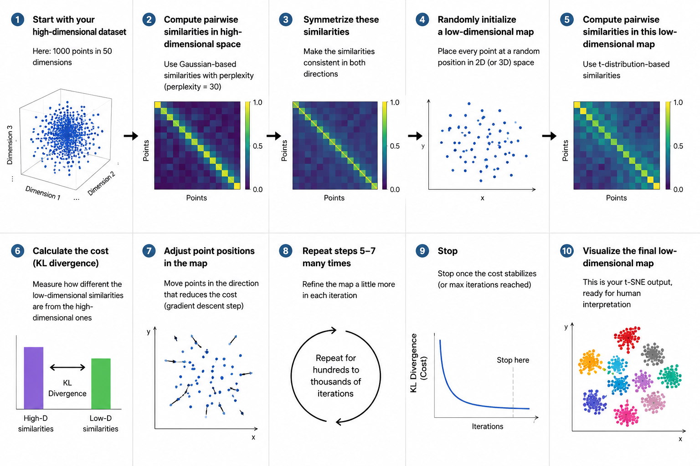

# Module 08: t-Distributed Stochastic Neighbor Embedding (t-SNE)

## What You Will Learn

By the end of this module, you will be able to:
- Explain the intuition behind t-SNE, including why it is preferred for high-dimensional visualization over linear techniques like PCA.
- Understand the **Crowding Problem**, why it happens, and how the Student t-distribution resolves it.
- Read and interpret the mathematical formulation of high-dimensional Gaussian conditional probabilities, symmetrized similarities, low-dimensional Cauchy joint probabilities, and the KL Divergence cost function.
- Walk through a complete, step-by-step worked numerical calculation showing how points are mapped from distance to neighbor-probabilities and how the t-distribution resolves space compression.
- Outline the steps of the t-SNE algorithm, from raw features to binary searches for perplexity-matched variances, gradient updates, and early exaggeration.
- Tune the core hyperparameters (perplexity, learning rate, iterations) to avoid visual artifacts like fragmented clusters or artificial groupings.
- Answer professional placement interview questions about t-SNE with conceptual depth and clarity.

---

## Lesson 8.1: The Intuition of Neighbor Embeddings

### What is t-SNE?
**t-Distributed Stochastic Neighbor Embedding (t-SNE)** is an unsupervised, non-linear dimensionality reduction technique developed by Laurens van der Maaten and Geoffrey Hinton in 2008. Its primary goal is to project high-dimensional data (e.g., images with 784 pixels, or text embeddings with 300 dimensions) onto a low-dimensional map (typically 2D or 3D) so that human eyes can easily explore cluster patterns, anomalies, and structure.

### Why is it needed?
Standard linear techniques like **PCA (Principal Component Analysis)** focus on preserving global variance and overall spread. However, PCA struggles when the underlying structure is non-linear (e.g., a spiral, or complex manifold) and is often poor at preserving small, local groupings. 

t-SNE preserves **local neighborhood relationships**. It ensures that points that are close (similar) in the original high-dimensional space remain close on the 2D map, and points that are far apart stay far apart.

### Real-World Analogies

#### 1. The Classroom Seating Chart
Imagine a classroom of 30 students. In the real world, students interact in a complex network based on mutual interests, project groups, and friendships (high-dimensional space). Now, the teacher wants to create a 2D seating chart on a flat grid of desks. 
- A **linear map (like PCA)** might look at the absolute coordinates of where they live in the city and project them down, causing close friends who live far apart to be separated.
- A **neighbor embedding (like t-SNE)** prioritizes keeping friends (local neighborhoods) seated next to each other, even if it has to distort the overall geometry of the classroom to make it fit.

#### 2. The Sprawling City Tourist Map
Imagine you have a detailed 3D model of a hilly, winding medieval city. You need to print a flat 2D tourist brochure map. 
- If you simply drop the 3D heights and squish the coordinates (like PCA), winding alleys will overlap, and separate neighborhoods will blend together.
- A smart cartographer (t-SNE) will warp distances slightly, making sure that adjacent houses stay adjacent on the map and separate neighborhoods stay distinct, even if the absolute highway distances across the city are distorted.

> [!NOTE]
> t-SNE is strictly a **visualization tool**. Because it distorts global distances and does not provide a simple, reusable projection matrix (like PCA), you should **never** use t-SNE as a feature extractor/preprocessing step before training a downstream classifier (e.g., Logistic Regression or SVM).

---

## Lesson 8.2: The Crowding Problem (The Core Challenge)

To understand why t-SNE works, we must first understand the mathematical curse it was designed to solve: **The Crowding Problem**.

### What is the Crowding Problem?
In a high-dimensional space, there is a massive amount of "volume" or "room" surrounding any data point. The volume of a sphere scales exponentially with its number of dimensions:
$$V(d) \propto r^d$$
where $d$ is the number of dimensions and $r$ is the radius.

Because of this exponential scaling, a point in a 10-dimensional space can have 10 orthogonal directions and plenty of room to accommodate many moderately-distant neighbors. However, when we project this data down to a 2D plane, the space available to represent these neighbors drops drastically. 

If we try to preserve the exact high-dimensional distances, there is simply not enough room on the 2D plane. All these moderately-distant neighbors get crushed and crowded together, collapsing into a single, uninformative, crowded blob at the center of the plot.

### Analogy: The Studio Apartment
Imagine moving a large extended family—grandparents, parents, siblings, cousins, and second cousins—from a 20-room mansion (high-D) into a single tiny studio apartment (2D). 
- In the mansion, cousins and second cousins have their own rooms and don't crowd the parents.
- In the tiny studio apartment, if you try to maintain the same distance rules ("everyone must be at least 10 feet away from the center"), everyone is pushed into the same corner, creating an uncomfortable, crowded pile of people where relationships are impossible to distinguish.

### The Solution: The Student t-Distribution
t-SNE solves this by using different similarity functions in the high-dimensional space and the low-dimensional space:
- In the **high-dimensional space**, similarities are computed using a **Gaussian (normal) distribution**, which has light tails.
- In the **low-dimensional space**, similarities are computed using a **Student t-distribution (specifically, 1 degree of freedom, which is a Cauchy distribution)**, which has **fat tails**.

```
Probability Density
    ^
    |         Gaussian (High-D: Light tails)
    |            _--_
    |           /    \
    |          /|    |\
    |        _/ |    | \_
    |    __--   |    |   --__
    |  _-       |    |       -_      Student t-distribution (Low-D: Fat/heavy tails)
    | /         |    |         \    /
    |/__________|____|__________\__/_
   -------------------------------------> Distance
```

The fat tails of the t-distribution mean that for a given similarity probability, the low-dimensional distance must be **much larger** than the corresponding high-dimensional distance. This gives the points "breathing room," naturally pushing moderately-distant clusters far away from each other on the 2D map, while keeping close neighbors tight.

---

## Lesson 8.3: Mathematical Blueprints & Symmetrized Similarities

### 1. High-Dimensional Conditional Similarity
For each pair of high-dimensional points $x_i$ and $x_j$, we compute the conditional probability $p_{j|i}$, which represents the likelihood that $x_i$ would pick $x_j$ as its neighbor under a Gaussian distribution centered at $x_i$:

$$p_{j|i} = \frac{\exp\left(-\frac{\lVert x_i - x_j \rVert^2}{2\sigma_i^2}\right)}{\sum_{k \neq i} \exp\left(-\frac{\lVert x_i - x_k \rVert^2}{2\sigma_i^2}\right)}, \quad p_{i|i} = 0$$

- $\lVert x_i - x_j \rVert^2$: The squared Euclidean distance between points $i$ and $j$.
- $\sigma_i$: The Gaussian bandwidth (variance) centered on $x_i$. This value is determined dynamically for each point via a binary search to match a user-defined **perplexity**.

### 2. Symmetrized Joint Probability
To make the similarity metric robust to outliers and simplify the gradient calculations, we define a symmetric joint probability $p_{ij}$ by averaging the conditionals and dividing by the total number of points $N$:

$$p_{ij} = \frac{p_{j|i} + p_{i|j}}{2N}, \quad p_{ii} = 0$$

This ensures that $p_{ij} = p_{ji}$ and $\sum_{i,j} p_{ij} = 1$. If a point is an outlier and far from all other points, its conditional probabilities $p_{i|j}$ will be extremely small, but its symmetrized joint probability $p_{ij}$ will still be dominated by the neighbor's perspective, ensuring it is not ignored during optimization.

### 3. Low-Dimensional Cauchy Similarity
In the low-dimensional space, we represent the points $x_i$ and $x_j$ as $y_i$ and $y_j$. We calculate their similarity $q_{ij}$ using a Student t-distribution with 1 degree of freedom (Cauchy distribution):

$$q_{ij} = \frac{\left(1 + \lVert y_i - y_j \rVert^2\right)^{-1}}{\sum_{k \neq l} \left(1 + \lVert y_k - y_l \rVert^2\right)^{-1}}, \quad q_{ii} = 0$$

- $\lVert y_i - y_j \rVert^2$: The squared Euclidean distance in the low-dimensional map.
- The term $\left(1 + \lVert y_i - y_j \rVert^2\right)^{-1}$ is the Cauchy kernel, which has much heavier tails than the Gaussian kernel.

### 4. The Cost Function: Kullback-Leibler (KL) Divergence
t-SNE optimizes the positions of the low-dimensional points $y_i$ by minimizing the difference between the probability distribution $P$ (high-D similarity) and the probability distribution $Q$ (low-D similarity). The mismatch is measured using the **KL Divergence**:

$$C = KL(P \parallel Q) = \sum_{i \neq j} p_{ij} \log\left(\frac{p_{ij}}{q_{ij}}\right)$$

- If $p_{ij}$ is large (points are close neighbors in high-D) but $q_{ij}$ is small (points are far apart in 2D), the ratio $\frac{p_{ij}}{q_{ij}}$ is large, creating a **high penalty**.
- If $p_{ij}$ is small (points are far in high-D) but $q_{ij}$ is large (points are close in 2D), the penalty is relatively small because it is multiplied by $p_{ij}$ (which is near zero).
- **Core takeaway:** t-SNE prioritizes preserving **local similarities** (large $p_{ij}$) over global distances (small $p_{ij}$).

| Symbol | Definition | Conceptual Meaning |
| :--- | :--- | :--- |
| $x_i, x_j$ | Input vectors in $\mathbb{R}^d$ | High-dimensional data points. |
| $y_i, y_j$ | Output vectors in $\mathbb{R}^2$ or $\mathbb{R}^3$ | Low-dimensional mapped coordinates. |
| $\sigma_i$ | Gaussian bandwidth (standard deviation) | Controls the width of the Gaussian kernel around $x_i$, adjusted according to local density. |
| $p_{j\|i}$ | Conditional probability | Probability that $x_i$ chooses $x_j$ as its neighbor in high-dimensional space. |
| $p_{ij}$ | Symmetrized joint probability | Normalized similarity between $i$ and $j$ in high-dimensional space. |
| $q_{ij}$ | Student-t joint probability | Normalized similarity between $i$ and $j$ in the low-dimensional map. |
| $C$ | KL Divergence | The cost function representing the information loss between the high-D and low-D distributions. |

---

## Lesson 8.4: Worked Numerical Example (Solving the Crowding Problem)

Let's walk through a concrete numerical example to see exactly how high-dimensional similarities are calculated and how the t-distribution resolves the crowding problem.

### 1. High-Dimensional Conditional Probabilities
Suppose we have a point $A$ in a high-dimensional space with two neighbors, $B$ and $C$. 
The squared Euclidean distances are:
- Squared distance to $B$: $\lVert x_A - x_B \rVert^2 = 2.0$
- Squared distance to $C$: $\lVert x_A - x_C \rVert^2 = 8.0$

Let's assume the local bandwidth around $A$ is determined to be $\sigma_A^2 = 1.0$.
We compute the Gaussian exponential weights:
- Weight for $B$: $\exp\left(-\frac{\lVert x_A - x_B \rVert^2}{2\sigma_A^2}\right) = \exp\left(-\frac{2}{2(1)}\right) = \exp(-1) \approx 0.3679$
- Weight for $C$: $\exp\left(-\frac{\lVert x_A - x_C \rVert^2}{2\sigma_A^2}\right) = \exp\left(-\frac{8}{2(1)}\right) = \exp(-4) \approx 0.0183$

The sum of weights is:
$$\text{Sum} = 0.3679 + 0.0183 = 0.3862$$

Now we calculate the conditional neighbor probabilities:
- Probability of picking $B$ as a neighbor:
  $$p_{B|A} = \frac{0.3679}{0.3862} \approx 0.9526 \quad (95.3\%)$$
- Probability of picking $C$ as a neighbor:
  $$p_{C|A} = \frac{0.0183}{0.3862} \approx 0.0474 \quad (4.7\%)$$

The ratio of similarity between $C$ and $B$ in high-dimensional space is:
$$\text{Ratio}_{\text{High-D}} = \frac{p_{C|A}}{p_{B|A}} = \frac{0.0474}{0.9526} \approx 0.0498 \quad (\approx 5\%)$$

---

### 2. Squeezing into Low-Dimensional Space

#### Case A: If we used a Gaussian distribution in 2D (No Fat Tails)
If we were to map these points to a 2D space using a Gaussian distribution, to maintain the exact same similarity ratio of $5\%$, the 2D squared distances would have to be identical to the high-dimensional ones:
- $d_{2D}(A, B)^2 = 2.0$
- $d_{2D}(A, C)^2 = 8.0$

Because space is heavily compressed in 2D, forcing $C$ to remain at a distance of $\sqrt{8} \approx 2.83$ would cause it to crowd close to $B$, which is at $\sqrt{2} \approx 1.41$. All points would collapse into a crowded space.

#### Case B: Using the Student t-Distribution in 2D (With Fat Tails)
Now let's see what happens using the Student t-distribution (Cauchy kernel) in the low-dimensional space:
$$q_{ij} \propto (1 + \lVert y_i - y_j \rVert^2)^{-1}$$

Suppose the low-dimensional mapped distance between $A$ and its close neighbor $B$ is set to $\lVert y_A - y_B \rVert^2 = 2.0$.
The Cauchy weight for $B$ is:
$$\text{Weight}_{2D}(B) = (1 + 2.0)^{-1} = \frac{1}{3} \approx 0.3333$$

To maintain the high-dimensional neighbor relationship, the similarity ratio between $C$ and $B$ must match the high-dimensional ratio ($\approx 0.0498$):
$$\text{Weight}_{2D}(C) = 0.0498 \times \text{Weight}_{2D}(B) = 0.0498 \times 0.3333 \approx 0.0166$$

Now we solve for the required low-dimensional distance of $C$, $\lVert y_A - y_C \rVert^2$:
$$\left(1 + \lVert y_A - y_C \rVert^2\right)^{-1} = 0.0166$$
$$1 + \lVert y_A - y_C \rVert^2 = \frac{1}{0.0166} \approx 60.24$$
$$\lVert y_A - y_C \rVert^2 \approx 59.24$$

#### The Geometric Consequence:
- In high-dimensional space, the ratio of squared distances was: $\frac{8.0}{2.0} = 4$.
- In low-dimensional space, using the Student t-distribution, the ratio of squared distances is: $\frac{59.24}{2.0} \approx 29.6$.

To represent the exact same similarity relationship in 2D, the moderately-distant point $C$ is pushed out from a squared distance of $8$ to a squared distance of **$59.24$**! This mathematical stretching is exactly how the t-distribution resolves the crowding problem, creating clear visual separations between different clusters on a 2D plot.

---

## Lesson 8.5: Step-by-Step t-SNE Algorithm



### 1. Data Preprocessing & Standardization
Before feeding data to t-SNE, the features must be standardized (mean=0, variance=1) or normalized to $[0, 1]$. Because t-SNE relies on Euclidean distances, scale mismatches will distort neighbor computations.

### 2. Dimensionality Reduction (PCA Pre-processing)
For high-dimensional inputs (e.g., MNIST with 784 pixels), it is standard practice to run **PCA** first to reduce the dimensionality to $50$. This:
- Filters out high-frequency noise.
- Speeds up the pairwise distance computations.
- Prevents the t-SNE optimization from getting stuck in local minima.

### 3. Compute High-Dimensional Probabilities
For each point $x_i$, the algorithm performs a **binary search** to find a unique Gaussian variance $\sigma_i^2$ that matches a user-defined target **perplexity**:
$$\text{Perplexity}(P_i) = 2^{H(P_i)}$$
where $H(P_i)$ is the Shannon entropy:
$$H(P_i) = -\sum_{j} p_{j|i} \log_2 p_{j|i}$$
Once the $\sigma_i$ values are found, the conditional probabilities are computed, symmetrized, and normalized to obtain the joint probabilities $p_{ij}$.

### 4. Initialize Low-Dimensional Map
Create a starting map $Y^{(0)}$ by placing each point at a random 2D coordinate drawn from a normal distribution with small variance:
$$y_i \sim \mathcal{N}(0, 10^{-4} I)$$
Alternatively, initializing $Y^{(0)}$ using the first 2 principal components of the dataset provides a deterministic and more stable starting layout.

### 5. Optimization Loop (Gradient Descent)
For each iteration $t$ up to a maximum (e.g., 1000):
- Calculate the low-dimensional Cauchy joint probabilities $q_{ij}^{(t)}$.
- Calculate the gradient of the KL Divergence with respect to each 2D point $y_i$:
  $$\frac{\partial C}{\partial y_i} = 4 \sum_{j} (p_{ij} - q_{ij})(y_i - y_j)\left(1 + \lVert y_i - y_j \rVert^2\right)^{-1}$$
- Update the coordinates using gradient descent with **momentum**:
  $$Y^{(t)} = Y^{(t-1)} - \eta \frac{\partial C}{\partial Y} + \alpha \left(Y^{(t-1)} - Y^{(t-2)}\right)$$
  where $\eta$ is the learning rate and $\alpha$ is the momentum coefficient.

> [!TIP]
> **Early Exaggeration:** During the first 100–250 iterations, the high-dimensional probabilities $p_{ij}$ are multiplied by a factor of 4. This force-multiplies the attraction between close points, creating highly concentrated, tight clusters early on and leaving empty space on the map for the clusters to drift and arrange themselves.

---

## Lesson 8.6: Hyperparameter Tuning, Connections & Comparisons

### Hyperparameter Tuning Guide

#### 1. Perplexity
- **What it is:** The zoom level of the neighborhood. It is the target effective number of neighbors each point considers when finding $\sigma_i$.
- **Typical Range:** 5 to 50.
- **Tuning Behavior:**
  - *Too Low (e.g., 2):* Fragments a single cluster into many tiny, disconnected blobs (local noise artifacts).
  - *Too High (e.g., 100):* Merges distinct clusters into a single large, uninformative blob (ignores local details).

#### 2. Learning Rate ($\eta$)
- **What it is:** The step size used for coordinate updates.
- **Typical Range:** 100 to 1000.
- **Tuning Behavior:**
  - *Too Low:* The optimization gets stuck in a crowded, unseparated layout (looks like a dense ball).
  - *Too High:* Points fly away from the origin, creating scattered, chaotic arrangements that do not converge.

#### 3. Max Iterations
- **What it is:** The number of gradient descent updates.
- **Typical Range:** 500 to 1000.
- **Tuning Behavior:** If the iterations are too low, the optimization terminates before the clusters have drifted to their stable locations, leaving them partially overlapped.

---

### Comparison of Dimensionality Reduction Techniques

| Feature | PCA | LDA | t-SNE | UMAP |
| :--- | :--- | :--- | :--- | :--- |
| **Type** | Linear | Linear | Non-linear | Non-linear |
| **Supervision** | Unsupervised | Supervised | Unsupervised | Unsupervised |
| **Objective** | Maximize global variance | Maximize class separation | Preserve local neighborhoods | Preserve local + global structure |
| **Solver** | SVD / Eigen-decomposition | Scatter Matrix ratio | Gradient Descent (KL loss) | Stochastic Gradient Descent |
| **Out-of-Sample** | Yes (`transform`) | Yes (`transform`) | No (must re-run) | Yes (`transform`) |
| **Complexity** | $O(d^3) + O(d^2 N)$ | $O(d^3) + O(d^2 N)$ | $O(N^2)$ (Exact) / $O(N \log N)$ | $O(N \log N)$ (Highly scalable) |
| **Stochastic?** | No (Deterministic) | No (Deterministic) | Yes (Stochastic) | Yes (Stochastic) |

---

### Intertopic Connections

- **Feature Engineering:** t-SNE is highly sensitive to input feature representation. Raw pixel distances are rarely ideal for complex images; running a CNN feature extractor or PCA beforehand significantly improves the quality of the neighbor map.
- **Bias-Variance:** Because t-SNE is stochastic, it exhibits high variance across random seeds. Running it multiple times is recommended to ensure cluster assignments are stable and not random artifacts of initialization.
- **Overfitting:** If the perplexity is set too low relative to the sample size, t-SNE can "overfit" to noise, showing beautiful clusters in completely random data. Always validate cluster reality using PCA or downstream classification metrics.

---

## Lesson 8.7: Placement & Interview Q&A

**Q1: What is the "Crowding Problem" in dimensionality reduction, and how does t-SNE solve it?**  
**Answer:** The crowding problem is the mathematical difficulty of representing high-dimensional distances on a low-dimensional (2D/3D) map due to the exponential reduction of volume. In high-D, points have many orthogonal directions to spread out. Squeezing them into 2D crowds them into a single center blob. t-SNE solves this by replacing the light-tailed Gaussian distribution in the high-D space with a heavy-tailed Student t-distribution in the low-D space. The fat tails force moderately-distant points much further apart on the map, providing breathing room for separate clusters.

**Q2: Why can we NOT trust the distance between clusters on a t-SNE plot?**  
**Answer:** t-SNE's cost function (KL Divergence) is built on neighbor-probabilities $p_{ij}$, which prioritize keeping close neighbors together. For far-apart points, $p_{ij} \to 0$, which means the optimization penalty for distorting large distances is negligible. As a result, t-SNE warps and stretches global space to accommodate local groupings, making inter-cluster distances unreliable for measuring absolute similarity.

**Q3: Why can we NOT trust the visual sizes of clusters on a t-SNE plot?**  
**Answer:** t-SNE adapts the local bandwidth $\sigma_i$ of each point to match the target perplexity. In dense regions, $\sigma_i$ is small; in sparse regions, $\sigma_i$ is large. This local scaling acts as an equalizer: sparse, spread-out clusters are drawn tighter, and small, dense clusters are expanded. Therefore, the physical size of a cluster on a t-SNE plot does not reflect its original variance.

**Q4: Can we use t-SNE to project new, unseen test data points into the 2D space?**  
**Answer:** No. Standard t-SNE does not learn a parametric mapping function (like a projection matrix in PCA or weights in a neural network). It directly optimizes the coordinates $Y$ of the input points. To project new data points, you would have to re-run the entire optimization on the combined dataset.

**Q5: What is the role of "Early Exaggeration" in t-SNE optimization?**  
**Answer:** Early exaggeration multiplies the high-dimensional probabilities $p_{ij}$ by a constant factor (typically 4) for the first 100–250 iterations. This scale increase forces the KL divergence gradient to heavily penalize points that are close in high-D but far in 2D. This clusters similar points into tight, compact islands early on, leaving plenty of empty space on the canvas for the clusters to reorganize and move past each other without getting tangled.

**Q6: What happens if you run t-SNE with a perplexity value that is too low?**  
**Answer:** A perplexity that is too low (e.g., 2) forces the algorithm to focus only on a few immediate neighbors, ignoring the broader structure. This results in the data fragmenting into many small, artificial sub-clusters (local noise artifacts) rather than forming cohesive global groups.

**Q7: How does t-SNE's complexity scale with the number of samples, and how do we resolve this?**  
**Answer:** Exact t-SNE has a time complexity of $O(N^2)$ because it computes all pairwise similarities. This is computationally expensive for large datasets. To resolve this, optimized implementations use the **Barnes-Hut approximation**, which constructs a quadtree (in 2D) or octree (in 3D) to approximate the forces from distant points as a single center-of-mass, reducing complexity to $O(N \log N)$.

**Q8: Why do we typically run PCA before applying t-SNE?**  
**Answer:** Running PCA first (typically reducing to 50 components) serves three purposes:
1. It reduces computational time by making initial distance calculations much faster.
2. It filters out high-frequency noise that could confuse distance computations.
3. It prevents the non-linear optimization from getting trapped in poor local configurations during initialization.

**Q9: Why does t-SNE produce different plots for the same dataset, and how do we fix it?**  
**Answer:** t-SNE is stochastic; its optimization starts with a random initialization of the low-dimensional coordinates $Y^{(0)}$. Because the cost function is non-convex and has many local minima, different starting points lead to different final layouts. To ensure reproducibility, you must set a fixed random seed (`random_state`) or initialize coordinates deterministically using PCA.

**Q10: What is the main difference between t-SNE and UMAP?**  
**Answer:** While both are non-linear, neighbor-preserving visual tools, UMAP is based on Riemannian geometry and algebraic topology. UMAP uses a fuzzy simplicial set representation and a cross-entropy cost function. Crucially, UMAP is much faster than t-SNE, scales better to large datasets, better preserves global structure alongside local structure, and allows for mapping new unseen test points.

---

## References

- **Original t-SNE Paper:** van der Maaten, L., & Hinton, G. (2008). *Visualizing Data using t-SNE*. Journal of Machine Learning Research, 9(Nov), 2579-2605.
- **Barnes-Hut t-SNE:** van der Maaten, L. (2014). *Accelerating t-SNE using Tree-Based Algorithms*. Journal of Machine Learning Research, 15(1), 3221-3245.
- **Distill.pub Visualization Guide:** Wattenberg, M., Viégas, F., & Johnson, I. (2016). *How to Use t-SNE Effectively*. Distill. [https://distill.pub/2016/misread-tsne/](https://distill.pub/2016/misread-tsne/)
