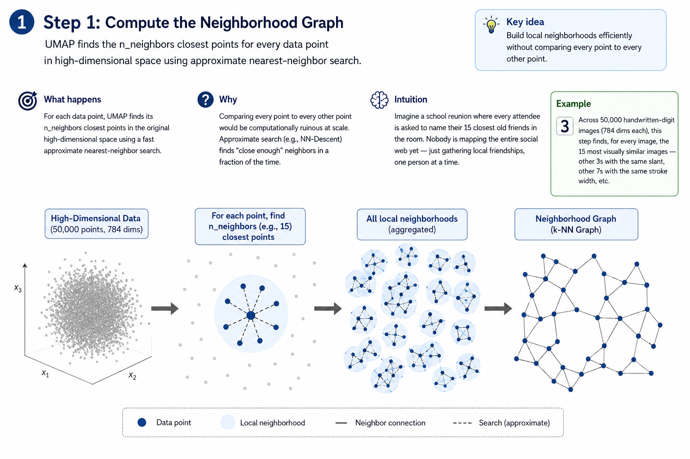

# UMAP: Uniform Manifold Approximation and Projection

> **Unveiling the Hidden Geometry of High-Dimensional Data — One Local Manifold at a Time.**

---

## 9.1 Introduction & The Intuition of Manifold Learning

### What Is UMAP?
**UMAP (Uniform Manifold Approximation and Projection)** is a modern, state-of-the-art non-linear dimensionality reduction algorithm published in 2018 by Leland McInnes, John Healy, and James Melville. It is designed to take extremely high-dimensional datasets and project them down to a visualizable 2D or 3D coordinate space. In doing so, UMAP ensures that similar data points remain close together (preserving local structures) and separate classes or groups remain distant (preserving global topological structures).

### Dimensionality Reduction Recap: The Sphere Analogy
Imagine we represent a student using 20 features: high school GPA, test scores, study hours, extracurricular activities, attendance, etc. Each feature is a **dimension**. This student is a single point in a **20-dimensional space**.

Humans cannot visualize anything beyond 3 dimensions. Dimensionality reduction behaves like a cartographer flattening a 3D globe onto a 2D paper map. You lose some geometric details (like exact spherical distances), but you gain a birds-eye view of the entire global landscape.

---

### Why Another Dimensionality Reduction Technique?
Before UMAP, data scientists relied on **PCA** or **t-SNE**. Both had structural limitations:

1. **PCA (Principal Component Analysis):** Fast and deterministic, but it assumes the data is linear. If your data bends, twists, or curves like a sheet of paper rolled into a cylinder, PCA will crush the paper and tear the topological relationships apart.
2. **t-SNE (t-Distributed Stochastic Neighbor Embedding):** Excellent at capturing non-linear curves, but it runs in $O(N^2)$ time, making it too slow for datasets exceeding 100,000 samples. More importantly, t-SNE only focuses on local neighborhoods. The distance *between* different clusters in a t-SNE plot is meaningless and random.
3. **UMAP's Advantage:**
    *   **Speed & Scalability:** Operates near $O(N)$ time in practice, processing millions of points in seconds.
    *   **Global & Local Preservation:** Preserves local cluster structures *and* their global relative positions.
    *   **Out-of-Sample Projection:** Unlike standard t-SNE, UMAP can learn a projection template and transform new, unseen test points without re-running the entire dataset.

---

### Real-World Analogy: The Vine Map
Imagine a massive, tangled grapevine growing inside a dark forest. The vine has thousands of leaves (data points) spread across 3D space, but the vine itself is a 1D line (the stem) winding through the forest.
*   **PCA** flattens the forest from above, overlapping branches and crushing the vine's curves.
*   **t-SNE** shows you that leaves on the same twig are close together, but it cuts the main stem into fragmented, isolated twigs scattered randomly across the page.
*   **UMAP** figures out that the leaves lie on a 1D "grapevine manifold," untangles the stem, and lays it flat on a table. Leaves on the same branch remain close, and the path of the main stem remains clear.


*Figure 1: High-dimensional raw features are converted into a neighborhood graph, initialized globally using spectral embeddings, and optimized via fuzzy cross-entropy.*

---

## 9.2 The Mathematical Blueprint

UMAP is built on advanced mathematical foundations (Riemannian geometry and algebraic topology). However, the algorithm boils down to three equations:

### Equation 1: Asymmetric Fuzzy Similarity (High-Dimensional Space)
UMAP measures the similarity between point $x_i$ and point $x_j$ using a Gaussian-like distribution, but with a local offset $\rho_i$ and an adaptive scale $\sigma_i$:

$$w_{j|i} = \exp\left( - \frac{\max(0, \, d(x_i, x_j) - \rho_i)}{\sigma_i} \right)$$

#### Symbols Legend
| Symbol | Mathematical Meaning | Conceptual Role in UMAP |
|:---|:---|:---|
| $w_{j|i}$ | Asymmetric similarity weight | The probability that $x_j$ is in $x_i$'s neighborhood (ranges from 0 to 1). |
| $d(x_i, x_j)$ | Distance metric | The raw distance between the points in high-dimensional space (e.g., Euclidean). |
| $\rho_i$ | Local distance offset | The distance from $x_i$ to its single nearest neighbor. This ensures that every point is connected to at least one neighbor with a weight of 1.0, preserving local manifold connectivity. |
| $\sigma_i$ | Adaptive bandwidth scale | A scaling factor determined via binary search such that the sum of neighbor weights matches the user-defined `n_neighbors` parameter ($k$): <br> $\sum_{j=1}^{k} w_{j|i} = \log_2(k)$. |

> [!NOTE]
> In high dimensions, data density varies. Sparser regions require larger search radii, while dense regions require smaller ones. By tuning $\sigma_i$ individually for every point, UMAP normalizes varying density scales.

---

### Equation 2: Fuzzy Set Union Symmetrization
Because the scaling parameter $\sigma$ and offset $\rho$ are computed locally, the connection weight from $x_i$ to $x_j$ ($w_{j|i}$) might not equal the weight from $x_j$ to $x_i$ ($w_{i|j}$). UMAP resolves this asymmetry using the union of fuzzy sets:

$$p_{ij} = p_{i|j} + p_{j|i} - p_{i|j} p_{j|i}$$

#### Why Fuzzy Set Union?
If we represent the neighborhood of a point as a fuzzy set, the probability of an edge existing between $i$ and $j$ is the union of the two directed edges. This formula ensures that if at least one point strongly sees the other as a neighbor, the final undirected link $p_{ij}$ remains strong.

---

### Equation 3: Low-Dimensional Similarity (Student-t Approximation)
In the 2D projected space, UMAP defines the similarity between the coordinates $y_i$ and $y_j$ using a heavy-tailed curve:

$$q_{ij} = \left( 1 + a \cdot \lVert y_i - y_j \rVert^{2b} \right)^{-1}$$

#### Symbols Legend
| Symbol | Mathematical Meaning | Conceptual Role |
|:---|:---|:---|
| $q_{ij}$ | Low-dimensional similarity | The similarity of points $i$ and $j$ on the 2D map. |
| $y_i, y_j$ | 2D/3D coordinate vectors | The target coordinates optimized during layout construction. |
| $a, b$ | Fitted hyper-parameters | Curve-fitting constants adjusted to approximate a step function based on the `min_dist` parameter. For default `min_dist=0.1`, $a \approx 1.93$ and $b \approx 0.79$. |

---

### Equation 4: Fuzzy Cross-Entropy Loss
UMAP optimizes the positions of the low-dimensional coordinates by minimizing the cross-entropy between the high-dimensional similarity $p_{ij}$ and the low-dimensional similarity $q_{ij}$:

$$\mathcal{L}_{CE} = \sum_{i \neq j} \left[ p_{ij} \log\left(\frac{p_{ij}}{q_{ij}}\right) + (1 - p_{ij}) \log\left(\frac{1 - p_{ij}}{1 - q_{ij}}\right) \right]$$

#### Why Cross-Entropy Beats KL Divergence
*   **The Left Term (Attraction Force):** active when $p_{ij} \approx 1$. If two points are neighbors in high-D, this term pulls their 2D coordinates close together.
*   **The Right Term (Repulsion Force):** active when $p_{ij} \approx 0$. If two points are not neighbors, this term pushes their 2D coordinates apart.
*   *Contrast with t-SNE:* t-SNE uses KL Divergence, which lacks the second term. Consequently, t-SNE focuses entirely on attraction, allowing clusters to drift anywhere on the map. UMAP's repulsion term preserves the global layout.

---

## 9.3 Worked Numerical Example

Let's trace how UMAP processes a tiny dataset of 3 points in a 2D space:
*   $x_1 = [0, 0]$
*   $x_2 = [3, 0]$
*   $x_3 = [0, 4]$

### Step 1: Compute Raw Distance Matrix
Using Euclidean distance:
*   $d(x_1, x_2) = \sqrt{(3-0)^2 + (0-0)^2} = 3$
*   $d(x_1, x_3) = \sqrt{(0-0)^2 + (4-0)^2} = 4$
*   $d(x_2, x_3) = \sqrt{(3-0)^2 + (0-4)^2} = 5$

$$D = \begin{pmatrix} 0 & 3 & 4 \\ 3 & 0 & 5 \\ 4 & 5 & 0 \end{pmatrix}$$

### Step 2: Determine Nearest Neighbor Offsets ($\rho_i$)
The offset $\rho_i$ is the distance to the single nearest neighbor for point $i$:
*   For $x_1$, neighbors are $x_2$ ($d=3$) and $x_3$ ($d=4$). The nearest is $x_2$, so **$\rho_1 = 3$**.
*   For $x_2$, neighbors are $x_1$ ($d=3$) and $x_3$ ($d=5$). The nearest is $x_1$, so **$\rho_2 = 3$**.
*   For $x_3$, neighbors are $x_1$ ($d=4$) and $x_2$ ($d=5$). The nearest is $x_1$, so **$\rho_3 = 4$**.

### Step 3: Compute Asymmetric Similarities ($w_{j|i}$)
For simplicity, we assume the bandwidth parameter $\sigma_i = 1$ for all points:
*   **For $x_1$:**
    *   $w_{2|1} = \exp(-\max(0, d(x_1, x_2) - \rho_1) / 1) = \exp(-\max(0, 3 - 3)) = \exp(0) = 1.0$
    *   $w_{3|1} = \exp(-\max(0, d(x_1, x_3) - \rho_1) / 1) = \exp(-\max(0, 4 - 3)) = \exp(-1) \approx 0.368$
*   **For $x_2$:**
    *   $w_{1|2} = \exp(-\max(0, d(x_2, x_1) - \rho_2) / 1) = \exp(-\max(0, 3 - 3)) = \exp(0) = 1.0$
    *   $w_{3|2} = \exp(-\max(0, d(x_2, x_3) - \rho_2) / 1) = \exp(-\max(0, 5 - 3)) = \exp(-2) \approx 0.135$
*   **For $x_3$:**
    *   $w_{1|3} = \exp(-\max(0, d(x_3, x_1) - \rho_3) / 1) = \exp(-\max(0, 4 - 4)) = \exp(0) = 1.0$
    *   $w_{2|3} = \exp(-\max(0, d(x_3, x_2) - \rho_3) / 1) = \exp(-\max(0, 5 - 4)) = \exp(-1) \approx 0.368$

### Step 4: Symmetrize the Probabilities ($p_{ij}$)
Using the fuzzy set union formula $p_{ij} = w_{j|i} + w_{i|j} - w_{j|i} w_{i|j}$:
*   **$p_{12}$:** $1.0 + 1.0 - (1.0 \times 1.0) = \mathbf{1.0}$
*   **$p_{13}$:** $0.368 + 1.0 - (0.368 \times 1.0) = \mathbf{1.0}$
*   **$p_{23}$:** $0.135 + 0.368 - (0.135 \times 0.368) = 0.503 - 0.050 = \mathbf{0.453}$

### Step 5: Interpretation
1.  **$p_{12} = 1.0$ & $p_{13} = 1.0$:** Points $x_1$ and $x_2$ are strongly linked, as are $x_1$ and $x_3$.
2.  **$p_{23} = 0.453$:** Points $x_2$ and $x_3$ are far apart, resulting in a weak connection.
3.  During optimization in 2D, $x_1$ will act as a central anchor, pulling both $x_2$ and $x_3$ toward it, while the weak similarity $p_{23}$ will allow $x_2$ and $x_3$ to repel each other, keeping the global right-angle triangle layout intact.

---

## 9.4 The UMAP Algorithm & Workflow

```
Raw Data
   │
   ▼
[Step 1: KNN Graph construction] ──► Uses NN-Descent to speed up neighborhood searches
   │
   ▼
[Step 2: Fuzzy Weighting & Union] ──► Normalizes local densities and symmetrizes edges
   │
   ▼
[Step 3: Spectral Initialization] ──► Places 2D coordinates using Laplacian Eigenmaps
   │
   ▼
[Step 4: Layout Optimization] ──► Runs SGD with Negative Sampling on Cross-Entropy
   │
   ▼
Compressed 2D Coordinates
```

### Step 1: Approximate Nearest Neighbor Graph
*   **What UMAP does:** Finds the $k$ nearest neighbors (set by `n_neighbors`) for every data point.
*   **How it works:** Instead of performing an expensive exact distance sweep ($O(N^2)$), UMAP uses **NN-Descent** (Nearest Neighbor Descent). This iterative algorithm projects points randomly and refines neighborhoods by comparing neighbors of neighbors, yielding a near-linear runtime of $O(N^{1.14})$.

### Step 2: Graph Construction & Symmetrization
*   **What UMAP does:** Converts distances into probability weights using Equation 1 and symmetrizes them using Equation 2.
*   **How it works:** This creates a fuzzy simplicial set—a weighted graph where edges represent neighborhood similarity probabilities.

### Step 3: Spectral Initialization
*   **What UMAP does:** Generates the initial 2D layout coordinates.
*   **How it works:** Instead of starting with random placements, UMAP uses **Spectral Embedding** (Laplacian Eigenmaps). This step solves the eigenvectors of the graph's Laplacian matrix to approximate a rough global layout of the clusters, placing similar components close together before optimization begins.

### Step 4: Force-Directed Layout Optimization
*   **What UMAP does:** Minimizes the cross-entropy loss by moving the 2D coordinates.
*   **How it works:** Runs Stochastic Gradient Descent (SGD). To speed up the repulsion step, UMAP uses **Negative Sampling**: for every attractive force update between neighbors, it randomly samples a few non-neighbors and applies a repulsive force, avoiding an $O(N^2)$ sweep.

---

## 9.5 Critical Hyperparameter Tuning

UMAP's output depends heavily on two key hyperparameters:

### 1. `n_neighbors` (Local vs. Global Balance)
*   **What it does:** Sets the size of the local neighborhood search window.
*   **Tuning Effects:**
    *   **Low values (e.g., 2 to 10):** Focuses on local structure. The map will fragment into small, fine-grained micro-clusters.
    *   **High values (e.g., 30 to 100+):** Focuses on global structure. The algorithm merges small groups to highlight the overall layout of the data manifold.

### 2. `min_dist` (Cluster Density Control)
*   **What it does:** Sets the minimum allowed distance between points in the 2D output.
*   **Tuning Effects:**
    *   **Low values (e.g., 0.0 to 0.05):** Points pack tightly together. Excellent for downstream clustering (e.g., feeding coordinates to K-Means or DBSCAN).
    *   **High values (e.g., 0.2 to 0.8):** Points spread out. Useful for visualizing continuous manifold transitions (e.g., cell development trajectories).

---

## 9.6 Dimensionality Reduction Comparison Matrix

| Feature | PCA | LDA | t-SNE | UMAP |
|:---|:---|:---|:---|:---|
| **Linearity** | Linear | Linear | Non-Linear | Non-Linear |
| **Model Type** | Matrix Decomposition | Supervised Classification | Probabilistic Neighbor Embedding | Topological Manifold Learning |
| **Preserves** | Global Variance | Class Separability | Local Neighborhoods | Local & Global Structures |
| **Time Complexity** | $O(D^3) + O(N \cdot D^2)$ | $O(N \cdot D^2) + O(D^3)$ | $O(N^2)$ (or $O(N \log N)$ Barnes-Hut) | $O(N \log N)$ (via NN-Descent) |
| **Deterministic?** | Yes | Yes | No (requires random seed) | No (requires random seed) |
| **Project New Data?**| Yes (via projection matrix) | Yes (via decision boundary) | No | Yes (via learned embedding template) |

---

## 9.7 Placement & Interview Q&A

#### Q1: What is the main mathematical difference between UMAP and t-SNE?
**Answer:** The difference lies in their objective functions and probability mappings:
1.  **Objective Function:** t-SNE minimizes KL Divergence, which only penalizes points that are close in high-D but far on the map (attraction). UMAP minimizes Cross-Entropy, which penalizes both neighbor mismatches (attraction) and non-neighbor mismatches (repulsion), preserving global layout.
2.  **Probability Mapping:** t-SNE normalizes similarities globally using a partition function denominator, requiring $O(N^2)$ operations. UMAP normalizes distances locally using adaptive bandwidth scales $\sigma_i$, avoiding the global denominator.

#### Q2: What is the purpose of the local connectivity parameter $\rho_i$ in UMAP?
**Answer:** $\rho_i$ is the distance from point $x_i$ to its nearest neighbor. Subtracting $\rho_i$ from raw distances ensures that the similarity weight to the closest neighbor is exactly $\exp(0) = 1.0$. This mathematically guarantees that every point has a connection strength of $1.0$ to the manifold, preventing isolated outliers from being disconnected from the graph.

#### Q3: Why does UMAP typically run much faster than t-SNE?
**Answer:** t-SNE relies on tree-based search structures (like Vantage Point trees) and a global normalization denominator, which scale poorly. UMAP speeds up nearest-neighbor search to $O(N \log N)$ using **NN-Descent** (projecting random projections and local sharing). During layout optimization, UMAP uses **Negative Sampling** instead of evaluating all pairs, keeping SGD execution times close to linear.

#### Q4: Why is it recommended to run PCA before UMAP?
**Answer:** While UMAP is non-linear, high-dimensional spaces (like raw 784-D pixels) contain a lot of noise. Running PCA first to compress the data to 50 dimensions filters out high-frequency noise, speeds up Euclidean distance calculations, and helps the approximate nearest neighbor finder locate true topological structures.

#### Q5: How do you evaluate the quality of a UMAP projection quantitatively?
**Answer:** Since UMAP is unsupervised, we evaluate it using two main metrics:
1.  **Trustworthiness Score:** Measures how well the 2D neighborhood matches the high-D neighborhood. It calculates whether points that are close in 2D were also close in high-D (values close to 1.0 are ideal).
2.  **Downstream Classification Accuracy:** Train a simple KNN classifier on the 2D UMAP coordinates. If the classifier achieves high cross-validated accuracy, it proves the clusters are cleanly separated.

---

## References & Further Reading

*   **Original UMAP Paper:** McInnes, L., Healy, J., & Melville, J. (2018). *UMAP: Uniform Manifold Approximation and Projection for Dimension Reduction.* [arXiv:1802.03426](https://arxiv.org/abs/1802.03426).
*   **Official Documentation:** [umap-learn.readthedocs.io](https://umap-learn.readthedocs.io/).
*   **Visualizing UMAP Parametric Tuning:** [Understanding UMAP Parameter Behavior](https://umap-learn.readthedocs.io/en/latest/parameters.html).