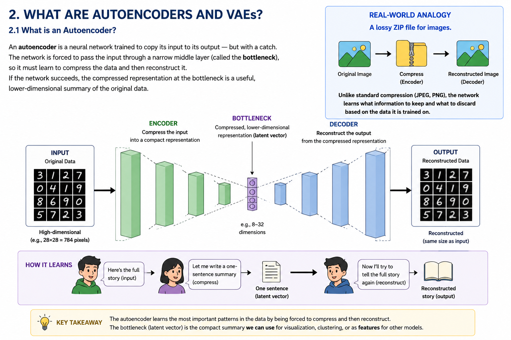
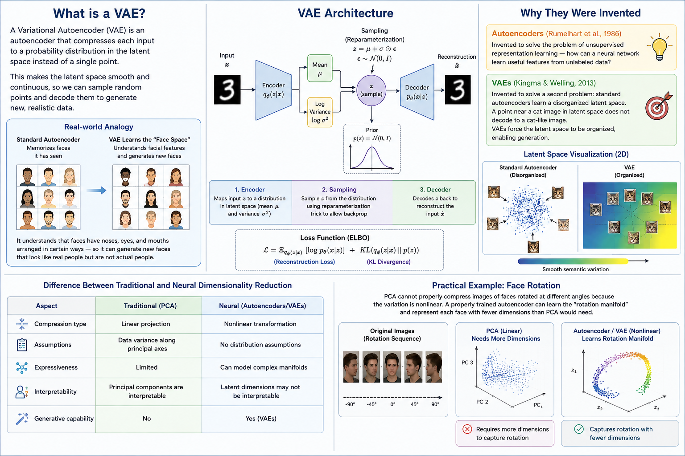
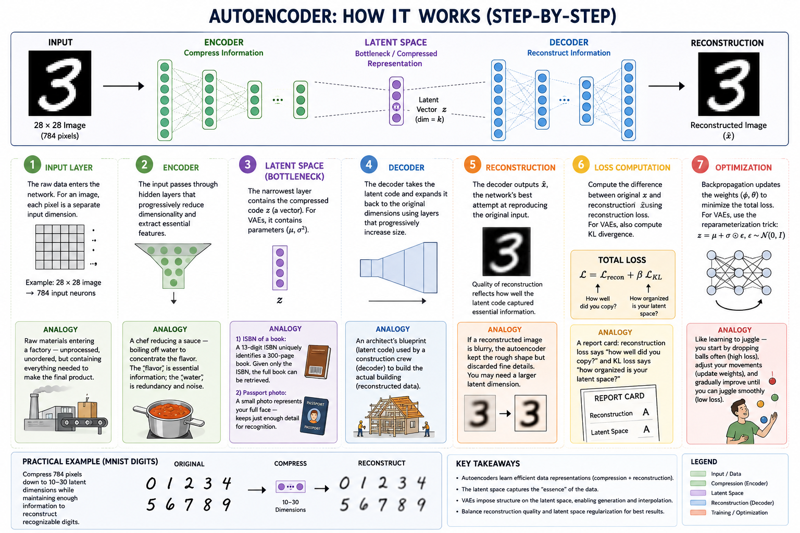

# 1. HEADER

# Autoencoders and Variational Autoencoders (VAE) for Dimensionality Reduction

**Learn to compress data like ZIP files for neural networks — then generate new data that never existed before.**

**What you will learn:** How neural networks can learn compact representations of data, reconstruct it faithfully, and even generate realistic new samples. You will understand both the intuition and the mathematics, implement them in code, and know exactly when to use (or avoid) them in production.

---

# 2. WHAT ARE AUTOENCODERS AND VAEs?

*Figure 1: Encoder → Bottleneck → Decoder workflow.*
## What is an Autoencoder?

An **autoencoder** is a neural network trained to copy its input to its output — but with a catch. The network is forced to pass the input through a narrow middle layer (called the **bottleneck**), so it must learn to compress the data and then reconstruct it. If the network succeeds, the compressed representation at the bottleneck is a useful, lower-dimensional summary of the original data.

Think of it like a **message game**: Person A hears a long story, summarizes it in one sentence for Person B, and Person B must retell the full story from that single sentence. If Person B can reconstruct the story well, the one-sentence summary captured the essential information. Autoencoders do exactly this with data.

**Real-world analogy:** A lossy ZIP file for images. The encoder compresses, the decoder decompresses. Unlike standard compression algorithms (JPEG, PNG), the network _learns_ what information to keep and what to discard based on the data it is trained on.

## What is a VAE?

*Figure 3: Variational Autoencoder with latent distribution sampling.*

A **Variational Autoencoder (VAE)** is an autoencoder with one critical upgrade: instead of compressing each input to a single point in the latent space, it compresses to a **probability distribution** (a range of possible values). This small change makes the latent space smooth and continuous, which means you can sample random points from this distribution and decode them to generate entirely new, realistic data.

**Real-world analogy:** A standard autoencoder memorizes faces it has seen. A VAE learns the "face space" — it understands that faces have noses, eyes, and mouths arranged in certain ways — so it can generate a new face that looks like a real person but is not an actual person.

## Why They Were Invented

Autoencoders were invented (Rumelhart et al., 1986) to solve the problem of **unsupervised representation learning** — how can a neural network learn useful features from unlabeled data? VAEs (Kingma & Welling, 2013) were invented to solve a second problem: standard autoencoders learn a **disorganized latent space**. A point near a cat image in latent space does not decode to a cat-like image. VAEs force the latent space to be organized, enabling generation.

## Difference Between Traditional and Neural Dimensionality Reduction

| Aspect | Traditional (PCA) | Neural (Autoencoders/VAEs) |
|---|---|---|
| Compression type | Linear projection | Nonlinear transformation |
| Assumptions | Data variance along principal axes | No distribution assumptions |
| Expressiveness | Limited | Can model complex manifolds |
| Interpretability | Principal components are interpretable | Latent dimensions may not be interpretable |
| Generative capability | No | Yes (VAEs) |

PCA finds the best _straight-line_ projection of data. Autoencoders can learn _curved_ manifolds. If your data lives on a curved surface (e.g., images of a rotating object), linear methods waste dimensions; autoencoders do not.

**Practical example:** PCA cannot properly compress images of faces rotated at different angles because the variation is nonlinear. A properly trained autoencoder can learn the "rotation manifold" and represent each face with fewer dimensions than PCA would need.

---

# 3. MATHEMATICAL FORMULATION

We define an input vector **x** ∈ ℝd (d-dimensional, e.g., a 28×28 image has d = 784 pixels). The goal is to learn a latent representation **z** ∈ ℝk with k << d (e.g., k = 20).

## Encoder Equation

**z = fφ(x)**

- **z**: The compressed latent representation (bottleneck output).
- **fφ**: The encoder neural network, parameterized by weights φ.
- **x**: The input data.

The encoder maps the high-dimensional input down to a low-dimensional code. In a VAE, the encoder outputs two vectors: the mean **μ** and the log-variance **log(σ²)** of the latent distribution, not a single **z** directly.

**Practical significance:** The encoder is the "compression algorithm" learned by the network. It must preserve enough information for the decoder to reconstruct the original.

## Decoder Equation

**x̂ = gθ(z)**

- **x̂** (x-hat): The reconstructed output (an approximation of the original input).
- **gθ**: The decoder neural network, parameterized by weights θ.
- **z**: The latent code from the encoder.

The decoder takes the compressed code and tries to reconstruct the original data.

**Analogy:** Language translation. The encoder reads English and converts it to a thought (latent code). The decoder writes that thought in French. Different translators (different weights) produce different quality translations.

**Practical significance:** The quality of the decoder determines how well the compression preserves information. A perfect decoder means the latent code contains all necessary information.

## Reconstruction Loss

**Lrecon = ||x - x̂||²** (Mean Squared Error)

or

**Lrecon = -∑ [x log(x̂) + (1-x) log(1-x̂)]** (Binary Cross-Entropy)

- **||x - x̂||²**: The squared difference between each pixel/value of the original and reconstructed output.
- **∑**: Sum over all dimensions (e.g., all 784 pixels).
- **log**: Natural logarithm, used to compute cross-entropy.

MSE works well for continuous data (e.g., audio, normalized pixel values). BCE works better for binary data (e.g., black-and-white images).

**Practical significance:** This loss function tells the network "how wrong" the reconstruction is. Lower loss = better compression.

## Latent Representation

**z ∼ N(μ, σ²I)** (for VAEs only)

- **N(μ, σ²I)**: A multivariate Gaussian (normal) distribution with mean vector μ and covariance matrix σ²I (diagonal, independent dimensions).
- **∼**: "Sampled from" — the latent code is drawn randomly from this distribution, not computed deterministically.
- **μ**: The center of the latent distribution (learnt by encoder).
- **σ²**: The spread of the latent distribution (learnt by encoder).
- **I**: The identity matrix — each latent dimension is independent.

For a standard autoencoder: **z = fφ(x)** (deterministic, single point).

For a VAE: the encoder predicts a distribution, and **z** is sampled from it. This sampling is what makes VAEs generative.

**Practical significance:** The latent representation is the "digested essence" of the input. In a standard autoencoder, it is a single point. In a VAE, it is a region — nearby points decode to similar outputs.

## VAE Loss Function

**LVAE = Lrecon + β · LKL**

- **LVAE**: Total loss the VAE minimizes during training.
- **Lrecon**: Reconstruction loss (same as above).
- **β** (beta): A weighting hyperparameter that controls the trade-off between reconstruction quality and latent space organization. β = 1 is standard; higher β (β-VAE) forces more organized latent spaces at the cost of reconstruction quality.
- **LKL**: The KL Divergence term (see below).

## KL Divergence Term

**LKL = DKL(N(μ, σ²I) || N(0, I)) = -½ ∑ (1 + log(σ²) - μ² - σ²)**

- **DKL**: Kullback–Leibler divergence — a measure of how different two probability distributions are.
- **N(μ, σ²I)**: The distribution predicted by the encoder.
- **N(0, I)**: The standard normal distribution (mean 0, variance 1) — our "target" distribution.
- **∑**: Sum over all k latent dimensions.
- **μ²**: Squared mean for each dimension (penalizes moving away from 0).
- **σ²**: Variance for each dimension (penalizes variance deviating from 1).
- **log(σ²)**: Log-variance (the form the encoder outputs for numerical stability).

This term is the regularization that makes VAEs special. It pushes the encoder's output distributions toward the standard normal. Two effects: (1) the latent space becomes smooth and continuous, and (2) it prevents the network from "cheating" by making the variance extremely small (which would collapse the VAE into a standard autoencoder).

**Analogy:** Imagine a teacher (KL divergence) coaching a student (encoder) who draws circles. The teacher says "draw circles centered at (0,0) with radius 1." Every time the student draws a circle off-center or too large, the teacher subtracts points. The KL term is that teacher — it penalizes the encoder whenever its distribution strays from the standard normal.

**Practical significance:** The KL term is what makes the latent space "organized." Without it, the network would learn an arbitrary, fragmented latent space. With it, nearby points in latent space correspond to similar outputs, enabling generation.

**Watch out:** The KL term can dominate early training, pushing all latent distributions to N(0, I) and causing the decoder to ignore the latent code entirely (posterior collapse). The VAE then outputs the average of all training data. **Fix:** Use KL annealing — gradually increase β from 0 to 1 during training so the network learns to use the latent code before the KL penalty kicks in.

---

# 4. HOW IT WORKS (STEP-BY-STEP)

*Figure 2: Data compression and reconstruction process.*
## 1. Input Layer

The raw data enters the network. If you are working with images, each pixel is a separate input dimension. For a 28×28 grayscale image, the input layer has 784 neurons.

**Analogy:** Like the raw materials entering a factory — unprocessed, unordered, but containing everything needed to make the final product.

## 2. Encoder

The input passes through one or more hidden layers that progressively reduce the dimensionality. Each layer learns increasingly abstract features. Early layers detect edges; later layers combine edges into shapes and objects.

The encoder's job is to distill the input into its most essential features, discarding noise and unimportant details.

**Analogy:** A chef reducing a sauce — boiling off water to concentrate the flavor. The "flavor" is the essential information; the "water" is redundancy and noise.

## 3. Bottleneck / Latent Space

This is the narrowest layer in the network. For a standard autoencoder, it contains the compressed code **z** (a single vector). For a VAE, it contains the parameters of a probability distribution **(μ, σ²)**.

The latent space is the **compressed representation** — a lower-dimensional "essence" of the input. Its dimensionality (k) is a hyperparameter you choose.

**Analogy 1 — ISBN of a book:** A 13-digit ISBN uniquely identifies a 300-page book. Given only the ISBN, a librarian (decoder) can retrieve the full book. The ISBN is tiny, but it contains enough information to reconstruct the entire work.

**Analogy 2 — Passport photo:** A 2×2 inch passport photo represents your full face. It discards hair texture, skin pores, and background scenery — but keeps just enough detail for a customs officer to match it to the real you. The passport photo is the latent code; the real you is the original data.

**Practical example:** For the MNIST dataset (handwritten digits 0-9), a good autoencoder can compress 784 pixels down to 10-30 latent dimensions while maintaining enough information to reconstruct recognizable digits.

## 4. Decoder

The decoder takes the latent code and expands it back to the original data dimensions. It mirrors the encoder architecture (symmetrical), with layers that progressively increase dimensionality.

**Analogy:** An architect's blueprint (latent code) used by a construction crew (decoder) to build the actual building (reconstructed data).

## 5. Reconstruction

The final output **x̂** is the network's best attempt at reproducing the original input. The quality of reconstruction directly reflects how well the latent code captured the essential information.

**Practical example:** If you encode a photo of a dog and the reconstruction shows a blurry dog with no fur texture, the autoencoder learned the rough shape but discarded fine details. You might need a larger latent dimension.

## 6. Loss Computation

The network computes the difference between the original input **x** and the reconstruction **x̂** using the reconstruction loss. For VAEs, it also computes the KL divergence between the latent distribution and the standard normal.

These two (or three) terms are combined into a single loss value. Think of it as a **report card**: the reconstruction loss says "how well did you copy?" and the KL loss says "how organized is your latent space?"

## 7. Optimization

Backpropagation updates the network weights (φ and θ) to minimize the total loss. For VAEs, there is a trick called the **reparameterization trick**: instead of sampling **z** directly (which is not differentiable), we sample **ε ∼ N(0, I)** and compute **z = μ + σ · ε**. This makes the sampling operation differentiable, enabling gradient-based optimization.

The network trains over many epochs, gradually learning to compress and reconstruct better.

**Analogy:** Like learning to juggle — you start by dropping balls often (high loss), adjust your movements (update weights), and gradually improve until you can juggle smoothly (low loss).

---

# 5. KEY ASSUMPTIONS

Autoencoders and VAEs rely on three key assumptions about the data.

## 1. Data Contains Hidden Patterns

The data must lie on a **low-dimensional manifold**. Picture a crumpled bedsheet in 3D space — the sheet is 2D but folded into 3D. Your data is similar: it lives in a high-dimensional space (e.g., 784 pixels) but actually varies along only a few meaningful directions (digit shape, thickness, rotation). If the data is pure random noise, no manifold exists, and the autoencoder cannot learn anything useful — it will just memorize noise. **Practical check:** Use t-SNE or UMAP (tools that squeeze high-D data to 2D for visualization). If the plot looks like a random cloud with no clusters, autoencoders will likely fail.

## 2. A Useful Compressed Representation Exists

Not all data is compressible without loss. Image data works well because nearby pixels are correlated (redundant). Dense data with no redundancy — like a QR code, where every bit is essential — is harder to autoencode than a photograph with smooth gradients.

## 3. Reconstruction Quality Measures What Matters

Pixel-by-pixel similarity (MSE) is the loss function's proxy for "quality," but it is imperfect. Two images that look identical to a human can have high MSE (same face shifted by one pixel). Two images that look completely different can have low MSE (a gray image vs. a photograph with the same average pixel value). This mismatch between reconstruction loss and human perception is why perceptual losses and GANs were developed.

---

# 6. WHEN TO USE / WHEN NOT TO USE

| Use Autoencoder/VAE When | Use Something Else When |
|---|---|
| You need unsupervised feature learning (no labels) | You have labeled data and a clear supervised task (use supervised learning) |
| You want to reduce dimensionality for visualization or downstream models | You need perfectly invertible compression (use PCA with all components) |
| You need to generate new data samples (use VAE) | You need the highest quality generation (use GANs or diffusion models) |
| You suspect the data lies on a nonlinear manifold | Your data is already low-dimensional or linearly separable |
| You need to detect anomalies (reconstruction error is high for outliers) | You need real-time inference on very large batches (use simpler methods) |
| You have unlabeled data and want pre-training features for a downstream task | You have very little data (autoencoders need sufficient samples to learn meaningful compression) |

| Domain | Application |
|---|---|
| **Fraud detection** | Train autoencoder on legitimate transactions only; flag transactions with high reconstruction error as potential fraud |
| **Medical imaging** | VAE compresses MRI scans (256×256×128 → 64 latent dims) for efficient storage; reconstruct on-demand with acceptable loss |
| **E-commerce** | Autoencoder generates 50-dimensional product embeddings from 10,000-dimensional purchase histories for recommendation systems |
| **Game development** | VAE generates new texture assets by interpolating in latent space; artists blend styles without manual creation |
| **Robotics** | VAE compresses camera frames to latent space, removing lighting/shadows; policy trained on latent codes instead of raw pixels |

---

| Feature | PCA | Autoencoder | VAE |
|----------|----------|----------|----------|
| Type | Linear | Nonlinear | Probabilistic Nonlinear |
| Dimensionality Reduction | Yes | Yes | Yes |
| Generative Capability | No | No | Yes |
| Interpretability | High | Medium | Medium |
| Complexity | Low | Medium | High |

# 7. IMPLEMENTATION OVERVIEW

You can implement autoencoders and VAEs in three ways: from scratch (for learning), using high-level frameworks (for production), or using low-level frameworks (for research).

## From Scratch (NumPy + manual gradient computation)

| Aspect | Detail |
|---|---|
| **Advantages** | Complete understanding of every operation; no framework dependencies |
| **Limitations** | Extremely slow; no automatic differentiation; requires manual backpropagation; no GPU support without extra work |
| **When to use** | Learning purposes only — build once to understand, then never again |
| **Typical lines of code** | 300-500+ for a simple VAE |

## TensorFlow / Keras

**Use when:** Google-ecosystem production, TF Serving deployment, existing TF codebase. **Lines:** 50-100 (AE), 80-150 (VAE). Pros: high-level API, built-in training loops, TensorBoard. Cons: harder debugging than PyTorch, ecosystem fragmentation from TF 1→2 migration.

## PyTorch

**Use when:** Research, startups, new projects, need debugging ease. **Lines:** 60-120 (AE), 100-180 (VAE). Pros: Pythonic API, eager-by-default (easy debugging), dynamic graphs, Hugging Face ecosystem. Cons: production requires TorchScript/ONNX; historically weaker serving than TF.

**Production concerns:** latency (use smaller latent dim or ONNX Runtime), quality (increase latent dim, use convolutions), threshold drift (monitor reconstruction error over time, retrain periodically), cold start (bootstrap with PCA while collecting training data).

---

# 8. TOP 5 INTERVIEW QUESTIONS

## Q1: What is the difference between an autoencoder and a VAE?

**Strong answer:** A standard autoencoder compresses each input to a single deterministic point in latent space. A VAE compresses to a probability distribution (Gaussian, defined by μ and σ²), then samples a latent code from it during training. This makes the VAE latent space continuous — nearby points decode to similar outputs, enabling meaningful interpolation. VAEs can also generate new data by ignoring the encoder and sampling z ∼ N(0, I) directly. The KL divergence term enforces this structure by penalizing distributions that deviate from N(0, I).

**Interviewer expects:** Deterministic vs. probabilistic mapping, structured latent space, generative capability. Bonus: KL divergence enforcing the prior and the reparameterization trick enabling training.

## Q2: Why can't we just use PCA instead of an autoencoder?

**Strong answer:** PCA finds orthogonal axes of maximum variance — a linear projection. If data lies on a nonlinear manifold (e.g., face images under varying pose), PCA needs many components to capture the curved structure. Autoencoders use nonlinear activations (ReLU, tanh) between layers, enabling them to learn curved manifolds with fewer dimensions. Trade-off: PCA is deterministic, interpretable, has a closed-form solution that never gets stuck in local optima, and trains in seconds. Autoencoders require iterative optimization, hyperparameter tuning, and sufficient data to generalize.

**Interviewer expects:** Linear vs. nonlinear reduction, activation functions, trade-offs (deterministic vs. stochastic, interpretable vs. black-box).

## Q3: What is the reparameterization trick and why do we need it?

**Strong answer:** In a VAE, the encoder outputs μ and σ, and we need a sample z ∼ N(μ, σ²I) for the decoder. Sampling directly is a stochastic operation — backpropagation cannot compute gradients through a random node, so the encoder never learns. The reparameterization trick separates randomness from network parameters by writing z = μ + σ · ε, where ε ∼ N(0, I) is pure noise independent of the network. Gradients now flow through the deterministic path (μ and σ are differentiable operations), while the stochasticity comes from an external noise source. This makes the entire pipeline trainable with standard SGD.

**Interviewer expects:** Clear explanation of the gradient flow bottleneck, the fix (z = μ + σ·ε), and why it works. Bonus: this is the location-scale parameterization of the Gaussian — any location-scale family distribution can use the same trick.

## Q4: How would you detect anomalies using an autoencoder?

**Strong answer:** Train the autoencoder on normal (non-anomalous) data only. At inference, compute reconstruction error (MSE between input and reconstruction) per sample. Normal samples reconstruct well (low error). Anomalies — patterns the encoder never learned — cannot be compressed cleanly, producing high reconstruction error. Set a threshold using the validation set (95th or 99th percentile of normal errors). Samples above the threshold are flagged. In production, monitor the threshold over time because data drift can shift the error distribution. VAEs add an extra signal: the log-probability of the latent code under the prior, which drops for out-of-distribution inputs.

**Interviewer expects:** Training setup (normal-only), threshold selection, deployment considerations. Bonus: per-pixel error heatmaps to localize anomalies in images (e.g., defect on a manufactured part).

## Q5: Your VAE produces blurry outputs. What do you do?

**Strong answer:** Blurriness stems from pixel-wise loss (MSE/BCE) that averages over plausible outputs — when multiple sharp images are equally likely, the network learns their mean. Practical fixes: (1) increase the latent dimension — the bottleneck may be too tight; (2) replace MSE/BCE with a perceptual loss like LPIPS that compares VGG feature activations, preserving texture; (3) reduce the KL weight (β < 1) to prioritize reconstruction over latent space organization; (4) switch to VQ-VAE which uses discrete codes and avoids averaging behavior; (5) add a GAN discriminator (VAE-GAN) to force realistic outputs. First diagnostic step: distinguish between underfitting (latent dim too small) and loss-induced blur (increase latent dim first, then try perceptual loss).

**Interviewer expects:** Root-cause analysis (pixel loss averages over modes), multiple solutions with trade-offs. Bonus: knowing VQ-VAE discretization solves the averaging problem.

---

# 9. QUICK REFERENCE TABLE

| Aspect | Detail |
|---|---|
| **Learning Type** | Unsupervised (self-supervised) |
| **Algorithm Family** | Neural network-based dimensionality reduction / generative model |
| **Main Hyperparameters** | Latent dimension (k), number of layers, neurons per layer, activation functions, learning rate, β (VAE), batch size, optimizer |
| **Advantages** | Learns nonlinear manifolds; no label requirement; VAE enables generation; can be used for anomaly detection; flexible architecture |
| **Limitations** | Blurry outputs (VAE); requires sufficient data; latent dims may not be interpretable; training can be unstable; reconstruction loss ≠ perceptual quality |
| **Output** | Standard AE: compressed latent vector + reconstructed input. VAE: distribution parameters (μ, σ²) + reconstructed input + ability to generate novel samples |
---

# 10. REFERENCES & FURTHER READING

## Original Papers

- **Rumelhart, D. E., Hinton, G. E., & Williams, R. J. (1986).** Learning internal representations by error propagation. *Parallel Distributed Processing*. — The foundational work that introduced autoencoders as a mechanism for unsupervised representation learning.

- **Kingma, D. P., & Welling, M. (2014).** Auto-Encoding Variational Bayes. *ICLR*. — The paper that introduced VAEs and the reparameterization trick. This is the canonical VAE reference. https://arxiv.org/abs/1312.6114

- **Higgins, I., et al. (2017).** β-VAE: Learning Basic Visual Concepts with a Constrained Variational Framework. *ICLR*. — Introduced the β hyperparameter and demonstrated that higher KL weights lead to more disentangled representations.

- **van den Oord, A., et al. (2017).** Neural Discrete Representation Learning (VQ-VAE). *NeurIPS*. — A variant that uses discrete latent codes instead of continuous, producing higher-quality outputs.

## Documentation & Tutorials

- **TensorFlow VAE Tutorial:** https://www.tensorflow.org/tutorials/generative/cvae — Official Keras implementation of a convolutional VAE on MNIST.

- **PyTorch VAE Tutorial:** https://github.com/pytorch/examples/tree/main/vae — Official PyTorch VAE example.

- **Keras Autoencoder Guide:** https://keras.io/examples/generative/vae/ — Clean, well-documented Keras implementations.

## Books & Courses

- **Goodfellow, I., Bengio, Y., & Courville, A. (2016).** *Deep Learning.* MIT Press. Chapter 14 (Autoencoders) and Chapter 20 (Deep Generative Models). — The standard textbook reference.

- **Bishop, C. M. (2006).** *Pattern Recognition and Machine Learning.* Springer. Chapter 12 (Continuous Latent Variables). — Covers the probabilistic perspective that underpins VAEs.

- **Stanford CS236: Deep Generative Modeling** — Course notes and lectures covering VAEs, GANs, normalizing flows, and diffusion models.

## Additional Learning Resources

- **Distill.pub** — "Visualizing MNIST with a VAE" provides interactive visualizations of latent space traversal and interpolation.

- **Understanding VAEs (blog by Joseph Rocca):** A clear, visual explanation connecting variational inference to VAEs with minimal jargon.

- **The Annotated VAE (PyTorch):** Walkthrough of a VAE implementation with line-by-line explanation of the loss function and reparameterization.

---

> "Compression is understanding." — This principle, often attributed to information theory, captures why autoencoders matter: a network that can compress data must, in some sense, understand its structure. VAEs extend this from compression to creation.
